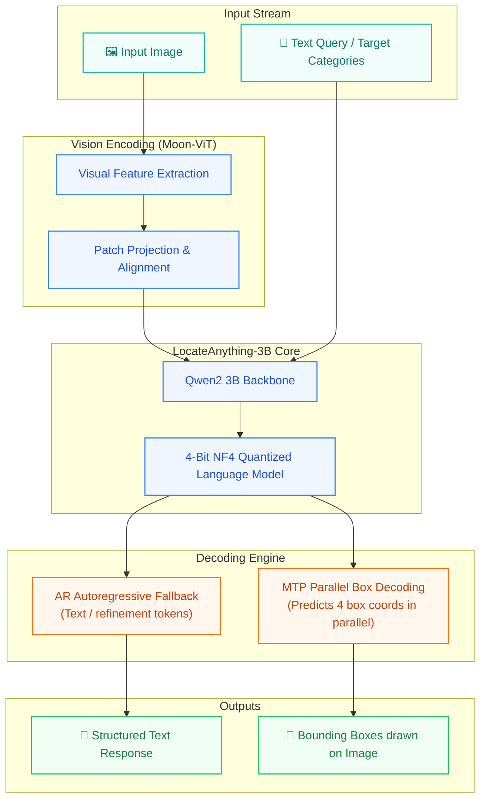
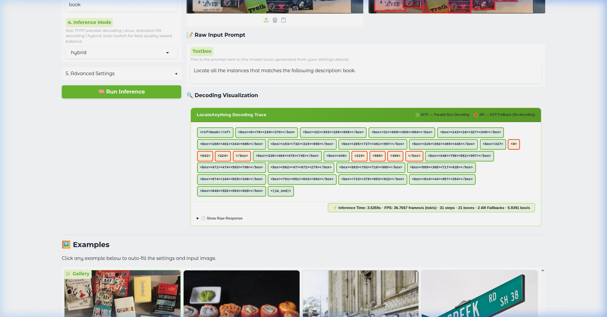

# LocateAnything-3B Inference Suite

Official Gradio inference web application for **LocateAnything-3B**, a state-of-the-art vision-language model designed for object detection and visual grounding with natural language.

📄 **Paper:** [arxiv.org/abs/2605.27365](https://arxiv.org/abs/2605.27365)  
🤗 **Model Hub:** [nvidia/LocateAnything-3B](https://huggingface.co/nvidia/LocateAnything-3B)
---

## 📐 Model Architecture



---

## 🖥️ Running UI Interface

Below is the interface running inference on target query categories, showcasing the visual bounding box coordinates and the execution stats trace:



---

## 🌟 Features

* **Multi-Format Task Support**: Locate objects, perform visual grounding, GUI layout parsing, OCR box detection, and pointing tasks.
* **MTP (Multi-Token Prediction) Parallel Decoding**: Speeds up inference by decoding multiple bounding box coordinates in parallel.
* **AR (Autoregressive) Fallback**: Seamless transition to standard autoregressive decoding when refinement is needed.
* **4-Bit NF4 Quantization**: Integrated `bitsandbytes` memory optimization, reducing required GPU memory from **10.5 GB** to only **~3.9 GB** total process VRAM.
* **Rich Decoding Visualization Trace**: Real-time stats panel displaying:
  * Inference execution time (in seconds)
  * Real-time generation throughput (FPS / Tokens per second)
  * Step details, predicted boxes, and AR fallback counts

---

## 🚀 Setup & Installation

### 1. Clone the Repository
```bash
git clone https://github.com/<your-username>/localizeanything.git
cd localizeanything
```

### 2. Install Dependencies
Create a virtual environment and install the required Python packages:
```bash
python3 -m venv venv
source venv/bin/activate
pip install -r requirements.txt
```

> [!NOTE]
> For 4-bit quantized loading, ensure you have a CUDA-compatible GPU, and that `bitsandbytes` and `accelerate` are successfully installed.

---

## 💻 Running the App

### Standard Inference (GPU Mode)
To run the Gradio application using the model weights (it will download automatically from Hugging Face on first launch):
```bash
python3 app.py
```

### Mock Mode (For Local/CPU Testing)
To run the application instantly without downloading the 3B model weights:
```bash
MOCK_MODE=1 python3 app.py
```

Open `http://127.0.0.1:7860` in your web browser.

---

## 📁 Repository Structure

```
├── app.py                # Main Gradio application code (Inference logic & UI)
├── requirements.txt      # Python dependencies
├── spaces.py             # Mock utility for HF Spaces zero-gpu decorators
├── assets/               # Image resources & font assets
│   ├── LXGWWenKai-Bold.ttf
│   ├── book.jpg
│   ├── ocr.jpg
│   ├── person.jpg
│   └── sweet.jpg
└── .gitignore            # Git exclusion rules
```

---

## 📝 Citation

If you find LocateAnything helpful in your research or applications, please cite:
```bibtex
@article{locateanything2026,
  title={LocateAnything: Locate Any Object in Images or Videos with Natural Language},
  author={NVIDIA Research},
  journal={arXiv preprint arXiv:2605.27365},
  year={2026}
}
```
